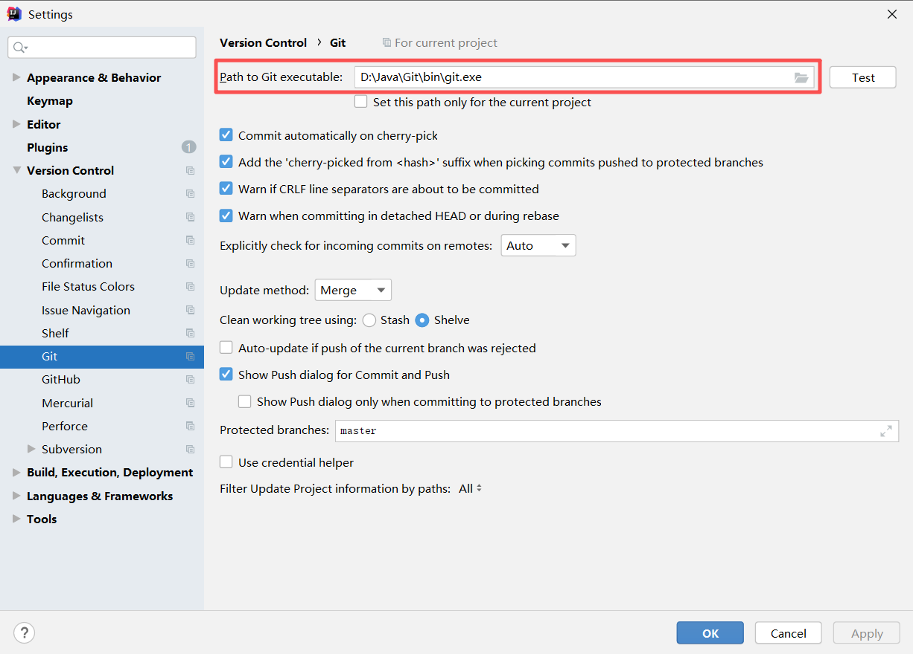
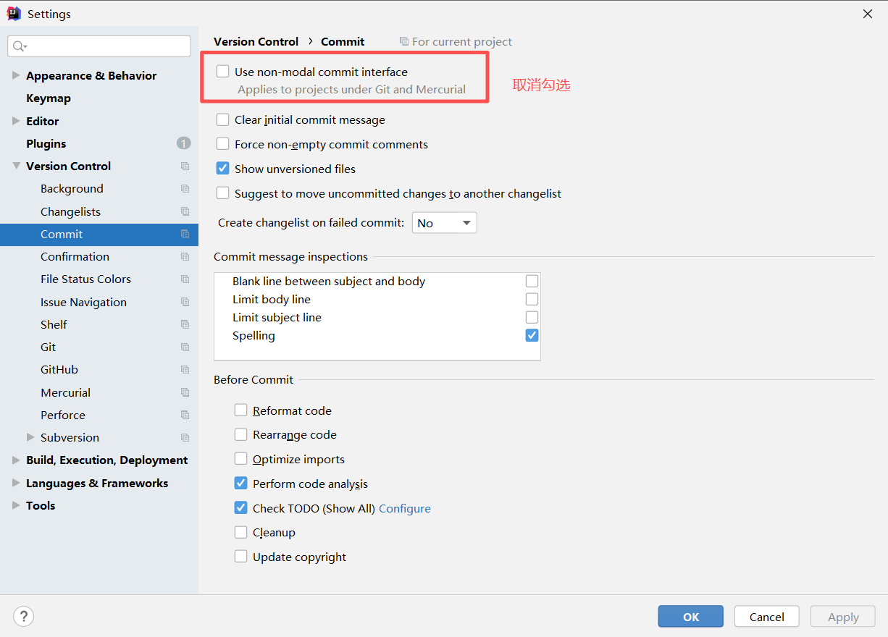
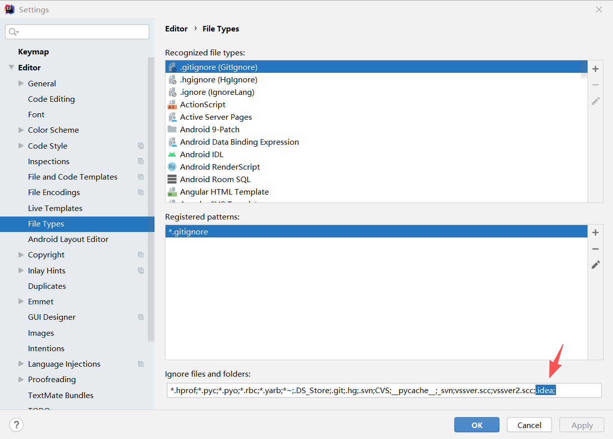

# git

### git安装
```
  官网下载地址:https://git-scm.com/download
```

### 环境变量配置
```
  系统变量path中新建：D:\Java\Git\bin
```
   
### git全局变量设置
```
--配置全局用户名
git config --global user.name "zhuchunming"

-- 配置邮箱
git config --global user.email "1003517931@qq.com"

-- 编码配置，避免git gui中显示中文乱码
git config --global gui.encoding utf-8

-- 避免git status显示中文文件名乱码
git config --global core.quotepath off

-- 配置git对文件大小写敏感
git config --global core.ignorecase false

# Git 图形界面编码
git config --global gui.encoding utf-8

# 提交信息编码
git config --global i18n.commitEncoding utf-8

# 日志输出编码
git config --global i18n.logOutputEncoding utf-8

# 路径名显示（解决文件名中文显示）
git config --global core.quotepath off

-- 查看到设置的全局配置信息
git config --list
```

### idea集成git
- 

#### 显示 lcoal changes
- 

#### 忽略文件夹
- 